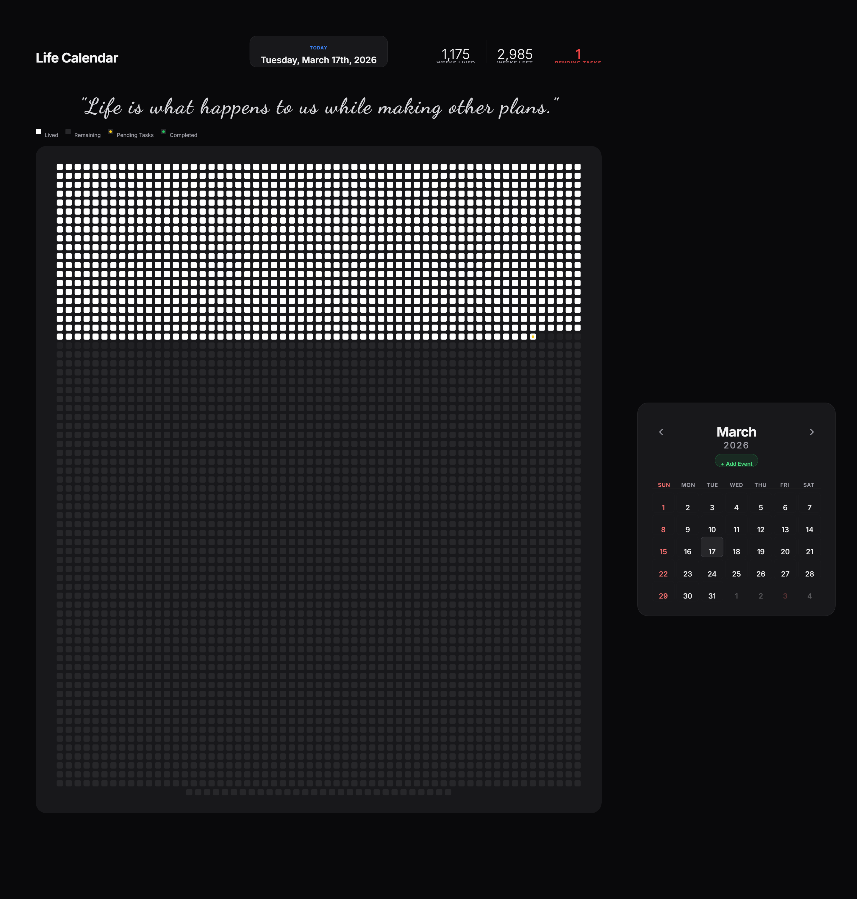

<h1 align="center">⏳ Life Calendar</h1>

<p align="center">
  Visualize your life in weeks. Stay aware. Stay intentional.
</p>

<p align="center">
  
  
  
</p>

---

## 🚀 Live Demo

🔗 https://your-live-demo-link.com
*(Deploy on GitHub Pages for maximum impact)*

---

## 🎯 About the Project

Life Calendar is a **visual productivity tool** that represents your entire life in weeks.

Each square = 1 week.

This simple idea helps you:

* Understand how limited time really is
* Stay focused on meaningful goals
* Build urgency and discipline

---

## 🧠 Why This Project Matters

Most people think they have “a lot of time”.

This project changes that perception by:

* Making time **visible**
* Turning abstract life into **real data**
* Encouraging **intentional living**

---

## 📸 Preview

<p align="center">
  
</p>

---

## ⚡ Features

✨ Life represented in weeks
📅 Automatic age calculation
🎯 Minimal and distraction-free UI
📱 Responsive design
🧠 Psychological awareness boost

---

## 🛠 Tech Stack

* HTML
* CSS
* JavaScript

---

## 📂 Project Structure

```
life-calendar/
 ├── index.html
 ├── style.css
 ├── script.js
 └── life-calendar-desktop.png
```

---

## ⚙️ Installation

```bash
git clone https://github.com/Pawankumar16122114/life-calendar.git
cd life-calendar
```

Open in browser:

```bash
index.html
```

---


## 🌍 Future Improvements

* Add yearly milestones
* Add goal tracking
* Dark mode 🌙
* Mobile app version

---

## 🤝 Contributing

Contributions are welcome!

1. Fork the repo
2. Create your branch
3. Commit changes
4. Open a Pull Request

---

## 📜 License

This project is licensed under the MIT License.

---

## 👨‍💻 Author

**Pawankumar**

* GitHub: https://github.com/Pawankumar16122114
* LinkedIn: *(add your link here)*

---

## ⭐ Support

If you like this project:

👉 Give it a ⭐ on GitHub
👉 Share with your friends

---

<p align="center">
  Made with ❤️ by Pawankumar
</p>
